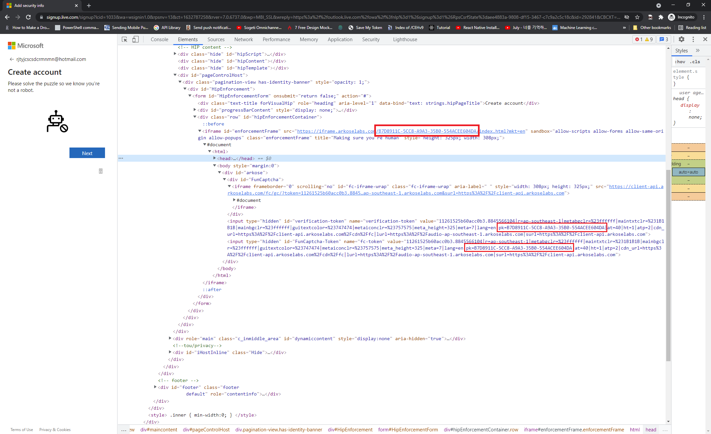

# funCaptcha

## Demo page

https://client-demo.arkoselabs.com/solo-animals

## How it works

https://developer.arkoselabs.com/docs

## How to solve

https://2captcha.com/p/funcaptcha

Locate the element with id `fc-token` and put the token into value of this element.

Do the rest what you need to do on the website: submit a form or click on a button or something else.

This is the only example that i've found


According to it selector for token field could be:

```js
// Id Selector
document.getElementById("FunCaptcha-Token");

// selector by attribute
document.querySelector('input[name="fc-token"]');

// update value
document.querySelector('input[name="fc-token"]').value = "test";
```

I found 2 field with id `verification-token` and `FunCaptcha-Token`. Later values from this field send to verify request. So maybe both are required.
