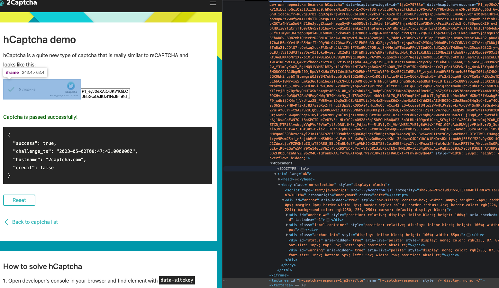

# hCaptcha

## Demo page

https://accounts.hcaptcha.com/demo

## How to solve

https://2captcha.com/demo/hcaptcha?difficulty=always-on

Locate the element with name `h-captcha-response` and use javascript to set the value of `h-captcha-response` field.

And last possible element it's iframe. After success solving frame also has additional attribute called `data-hcaptcha-response`. Value should be the same as we have for `h-captcha-response`. Example how to assign it later in this page.

```js
// h-captcha-response
document.querySelector('[name="h-captcha-response"]').value = token;

// this way should also work
document.getElementById("h-captcha-response").innerHTML = "TOKEN_FROM_2CAPTCHA";
```



Also maybe access to hcaptch iframe will be required. Here is selector

```js
// access to iframe
document.querySelector('iframe[src*="hcaptcha.com"]');

// get any attribute
document.querySelector('iframe[src*="hcaptcha.com"]').getAttribute("data-hcaptcha-widget-id")'

// set new value to attribute
document.querySelector('iframe[src*="hcaptcha.com"]').setAttribute("data-hcaptcha-widget-id", '123')
```

## Puppeteer code example

It's `puppeteer` code example but it can be usefull to find selectors

https://github.com/aw1875/puppeteer-hcaptcha/blob/typescript/src/hcaptcha.ts
